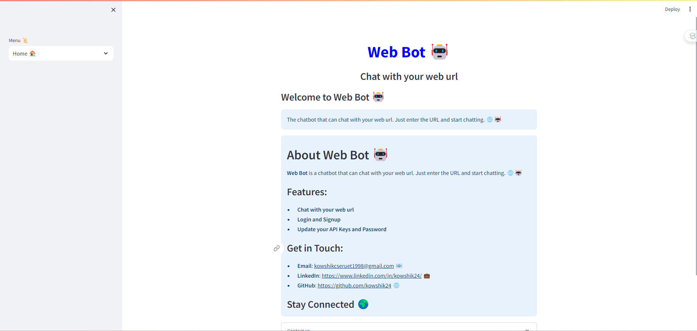
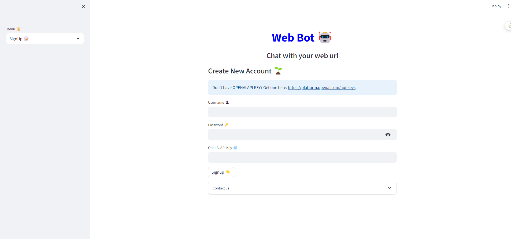
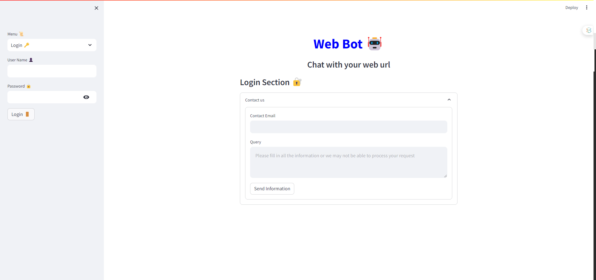
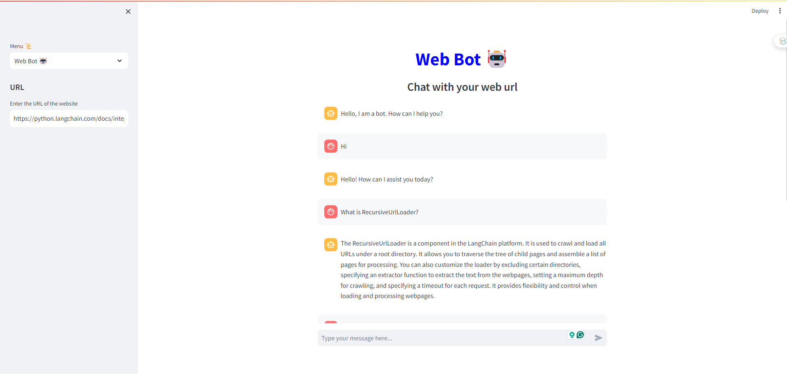

# Web Bot 🤖

Web Bot is an bot that chat with any Website and get the information from the website using Langchain and Web Scraping.

## Features 📋
- **Chat with any Website**: You can chat with any website and get the information from the website.
- **Web Scraping**: You can get the information from the website using Web Scraping.

- **Chroma DB**: You can store the information in the Chroma DB.

- **Sign Up**: You can sign up to the bot and get the information from the website.

- **Secure Password and API Key**: You can secure your password and API Key.

## Getting Started 🚀

To get started with the project, you need to clone the repository and install the dependencies.

1. **Clone the repository**:

```bash
git clone https://github.com/kowshik24/Web-Bot.git
```

2. **Install the dependencies**:

```bash
pip install -r requirements.txt
```

3. **Run the application**:

```bash
python app.py
```

## Demo 📸
---
📸 Screenshots

|  |  |
|:--------------------------------:|:--------------------------------:|
|     **Sample Visualization 1**   |     **Sample Visualization 2**   |
|  |  |


---

## Technologies Used 🛠️
- **Langchain**: Langchain is a Python library that helps to chat with any website.
- **Web Scraping**: Web Scraping is a Python library that helps to get the information from the website.
- **Chroma DB**: Chroma DB is a Python library that helps to store the information in the Chroma DB.
- **Flask**: Flask is a Python library that helps to create a web application.

## Contributing 🖇️
If you want to contribute to this project, you can create an issue and create a pull request.

---
📞 Contact Information
For support, feedback, or contributions, please reach out to:

- 📧 **Email**: [kowshikcseruet1998@gmail.com](mailto:kowshikcseruet1998@gmail.com)
- 📱 **Phone**: 01706 896161
- 🌐 **Website**: [https://kowshik24.github.io/kowshik.github.io/](https://kowshik24.github.io/kowshik.github.io/)
- 🚀 **GitHub**: [Kowshik Deb Nath](https://github.com/kowshik24)
- 🤝 **LinkedIn**: [Kowshik Deb Nath](https://www.linkedin.com/in/kowshik-deb-nath-7a0a3a1a0/)
---